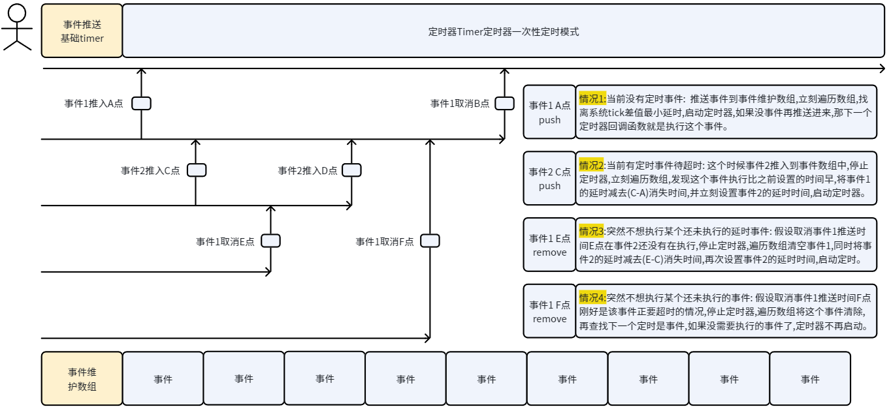
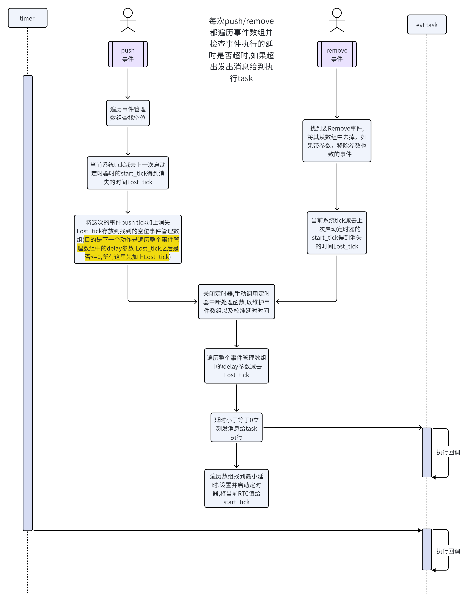
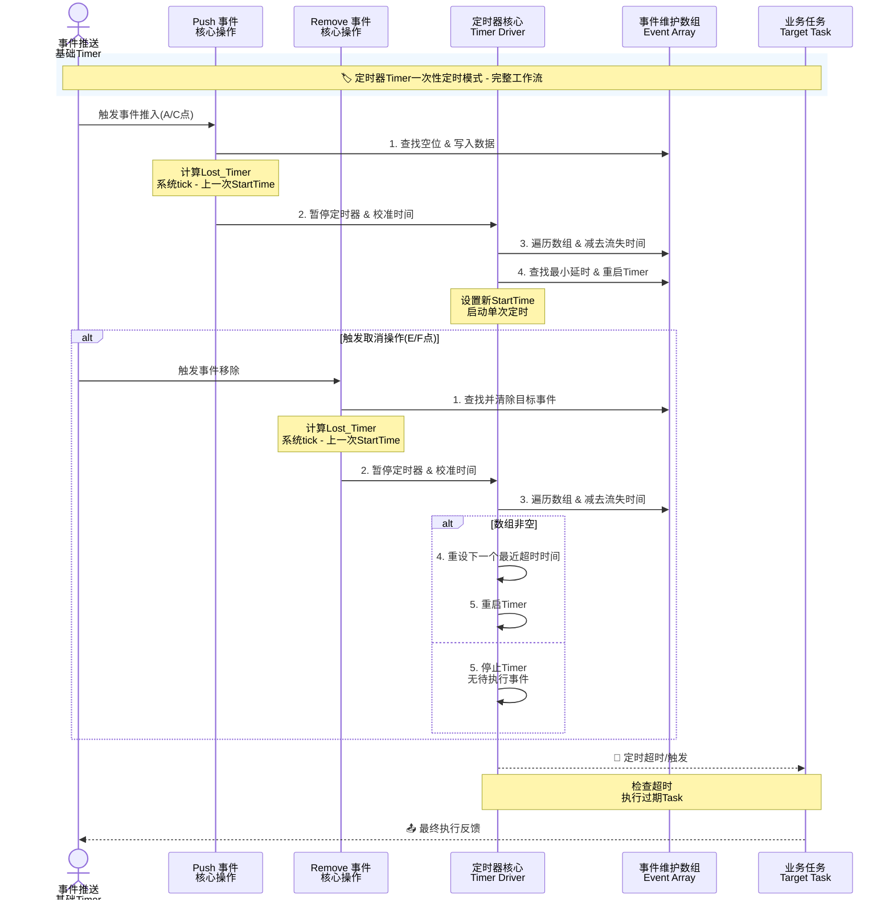

# Event Loop（事件循环）

> English：[README.md](./README.md)

## 1. 简介

**Event Loop** 是面向 RT-Thread 的软件包，用于在应用层调度**延迟回调**。待执行项保存在**定长延迟表**中；由**单次软定时器**推进时间；到期的任务通过**消息队列**投递，在专用线程 `**evt_loop`** 上执行（避免在软定时器线程里跑业务逻辑）。

典型场景：界面/状态机延后处理、错峰重试、或在回调里再次 `EVT_LOOP_PUSH` 形成链式定时行为。详细场景介绍：




## 2. 功能原理特性

原理流程图如下：



- **延迟投递** — `evt_loop_push_delayed()` / 宏 `**EVT_LOOP_PUSH(func, args, delay_ms)`**（`delay_ms <= 1` 时视为立即投递，走消息队列）。
- **取消** — `**EVT_LOOP_REMOVE(func)`** 会删除延迟表中该**函数指针**下的**全部**条目；`**EVT_LOOP_REMOVE_WITH_ARGS(func, args)`** 按函数与参数匹配删除（详见头文件与实现）。
- **独立线程 + 消息队列** — 用户回调在 `**evt_loop`** 线程执行；队列深度可配置（`EVENT_LOOP_MSGQ_DEPTH`）。
- **单实例单次软定时器** — 使用 `RT_TIMER_FLAG_ONE_SHOT | RT_TIMER_FLAG_SOFT_TIMER`；下次到期时间为表中**最小剩余延迟**。
- **并发安全** — 延迟表由 **mutex** 保护；重装定时器时在软定时器回调内先 `**rt_timer_stop`**，若仍因内核 `**RT_TIMER_FLAG_PROCESSING`** 无法 `rt_timer_start`，则通过**同一消息队列**延后到 `evt_loop` 线程再启动定时器。
- **可选示例** — 开启 `**EVENT_LOOP_USING_SAMPLES`** 会编译 `event_loop_test.c`，并在开启 FinSH/MSH 时导出命令 `**evt_loop_test`**。

## 3. 架构简图

```
[ 任意线程 ] --push_delayed/remove--> [ 延迟表 + 互斥锁 ]
                                            |
                  单次软定时器 --------------+--> 扣减时间 --> rt_mq 发送（到期项）
                                            |
                  evt_loop 线程 <------------+---- rt_mq 取出 --> 用户回调 (func, args)
```

以下为**单次软定时**模式下 Push / Remove / 超时投递的交互时序示意（与 `event_loop.c` 中延迟表 + 软定时器 + 消息队列一致；图中「流失时间」对应实现里的 `delay_diff` / `elapsed` 校准）。



## 4. API 说明

包含头文件 `**event_loop.h**`。


| 符号                                                      | 作用                                   |
| ------------------------------------------------------- | ------------------------------------ |
| `EVT_LOOP_PUSH(pfunc, pargs, delay_ms)`                 | 延迟调用；`pfunc` 类型为 `void (*)(void *)`。 |
| `EVT_LOOP_REMOVE(pfunc)`                                | 删除表中**所有**函数指针为 `pfunc` 的延迟项。        |
| `EVT_LOOP_REMOVE_WITH_ARGS(pfunc, pargs)`               | 按函数与参数删除指定项。                         |
| `evt_loop_push_delayed()` / `evt_loop_remove_delayed()` | 上述宏对应的 C API。                        |


包内使用 `**INIT_APP_EXPORT(_evt_loop_init)`** 自动初始化，应用一般无需再手动调用 init。

## 5. 目录结构

```
event_loop/
├── README.md              # 英文说明
├── README_zh.md           # 中文说明（本文件）
├── inc/
│   └── event_loop.h       # 对外 API
├── src/
│   └── event_loop.c       # 实现
├── samples/
│   └── event_loop_test.c  # 可选 MSH 示例
└── SConscript             # DefineGroup、CPPPATH
```

## 6. 依赖与 Kconfig

开启 `**PKG_USING_EVENT_LOOP**` 会选中：

- `RT_USING_MESSAGEQUEUE`
- `RT_USING_MUTEX`
- `RT_USING_TIMER_SOFT`

主要可配置项：


| 选项                             | 含义                                                                          |
| ------------------------------ | --------------------------------------------------------------------------- |
| `EVENT_LOOP_MAX_EVENT_CNT`     | 延迟表最大槽位数（默认 32）。                                                            |
| `EVENT_LOOP_MSGQ_DEPTH`        | 消息队列深度（默认 15）。                                                              |
| `EVENT_LOOP_THREAD_STACK_SIZE` | `evt_loop` 线程栈（默认 3072 字节）。                                                 |
| `EVENT_LOOP_THREAD_PRIORITY`   | 线程优先级（默认 12）。**必须大于 `RT_TIMER_THREAD_PRIO`**（数值更大表示比软定时器线程**更低**的 CPU 优先级）。 |
| `EVENT_LOOP_USING_SAMPLES`     | 是否编译示例（Kconfig 默认一般为关，以各 BSP 为准）。                                           |


## 7. 快速上手

### 7.1 menuconfig

## 如何添加该软件包

```
RT-Thread online packages
    system packages --->
        [*] Event loop (delayed dispatch: mq + soft one-shottimer) --->
            (32) Maximum delayed slots in table
            (15) Message queue depth (immediate + due callbacks)
            (3072) Event loop thread stack size (bytes)
            (12) Event loop thread priority (smaller = higher5
            [*] Build event_loop sample (event_loop_test.c)
```

1. 在 BSP 工程中打开 **menuconfig**。
2. 开启 `**PKG_USING_EVENT_LOOP`**（菜单描述含 *Event loop* / *delayed dispatch* 等）。
3. 按产品调整栈、优先级、表大小、队列深度。
4. 需要演示时可开启 `**EVENT_LOOP_USING_SAMPLES`**。
5. 保存配置，确认 `rtconfig.h` 中出现 `PKG_USING_EVENT_LOOP`。

### 7.2 编译

在 BSP 根目录执行 `scons`（或你常用的 RT-Thread 构建命令）。

### 7.3 应用代码示例

```c
#include "event_loop.h"

static void my_job(void *arg)
{
    /* 业务逻辑 */
    EVT_LOOP_REMOVE(my_job);
    /* 如需链式定时可再次 EVT_LOOP_PUSH(my_job, arg, delay_ms); */
}

/* 启动后任意线程中 */
EVT_LOOP_PUSH(my_job, (void *)ctx, 100);

/* 启动后任意线程中remove */
EVT_LOOP_REMOVE(my_job);

/* 启动后任意线程中remove特定参数 */
EVT_LOOP_REMOVE_WITH_ARGS(my_job, (void *)1);

```

### 示例动图（`evt_loop_test`）

开启 `**EVENT_LOOP_USING_SAMPLES**` 并在 FinSH/MSH 中执行 `**evt_loop_test**` 时的运行示意：


## 8. 使用注意

- **优先级** — 若编译报错提示 `event_loop` 优先级必须大于 `RT_TIMER_THREAD_PRIO`，请在 `rtconfig.h` 中把 `EVENT_LOOP_THREAD_PRIORITY` 配得**高于**（数值更大）软定时器线程优先级。
- **表满** — 延迟表耗尽时会打日志并丢弃本次 push，可通过 `EVENT_LOOP_MAX_EVENT_CNT` 加大容量。
- **同一函数多槽** — `EVT_LOOP_REMOVE(func)` 会清掉该函数的所有延迟项，设计回调链时请与此语义一致。

## 9. 许可协议

Apache License 2.0（详见各源文件 SPDX 与 `package.json`）。

## 10. 维护者与仓库

作者、仓库地址、版本下载等信息见 `**package.json`**。